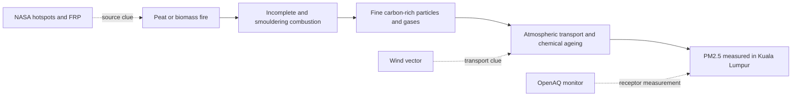

# HazeSignal research report

## Can satellite fire detections warn Malaysia about haze before ground monitors rise?

**Answer from this pilot:** not reliably yet. Fire activity contains some information, but the present fire-and-wind calculation did not beat a simple “tomorrow resembles today” comparison on unseen dates. That negative result identifies exactly what the next model must improve.

## Abstract

HazeSignal investigates whether satellite-detected fires in Sumatra and Kalimantan can provide an earlier warning of rising PM2.5 in Kuala Lumpur. It combines NASA FIRMS fire detections, Open-Meteo wind observations and OpenAQ ground measurements. The model uses transparent vector calculations and hand-written linear regression rather than a hidden forecasting library.

The exploratory September 2023 sample showed a positive same-sample relationship between wind-aligned hotspots and next-day PM2.5. A stricter test trained on September–October and evaluated 54 sufficiently complete target days in November–December. Hotspot count produced an average error of 2.80 µg/m³, almost identical to the 2.85 µg/m³ persistence baseline. Adding wind increased error to 5.91 µg/m³. Weighting fires by NASA fire radiative power also failed to improve the result. A separate 2025 check found that the live threshold missed both chances to warn before one unhealthy PM2.5 episode. HazeSignal is therefore an exploratory research clue, not a validated forecast.

## The research question

Ground monitors answer: **How polluted is the air here now?**

HazeSignal asks an earlier question: **Are fires active upwind, making a later PM2.5 rise physically plausible?**

The proposed chain is:



Each data source observes only one part of this chain. That is why a hotspot is not itself a haze measurement and why correlation cannot prove that a particular fire caused a particular reading.

## Why this is a materials-science problem

Peat is a porous, carbon-rich organic material. When it smoulders with limited oxygen, combustion is incomplete. The resulting smoke contains solid carbonaceous particles, condensed organic material, inorganic ions and gases. Measurements during a Sumatran peat-fire episode found organic carbon among the major PM2.5 components. [Environmental Science & Technology study](https://pubmed.ncbi.nlm.nih.gov/17547168/)

Particle output is not determined by heat alone. Field and laboratory work found that tropical peat-fire PM2.5 emissions change as an ash layer develops over the burning surface. A newer fire can emit fine particles differently from an older fire even when both remain detectable. [Geophysical Research Letters study](https://pubmed.ncbi.nlm.nih.gov/30167349/)

During transport, the mixture also changes. Organic vapours can condense or react to form secondary aerosol, while rain, humidity and atmospheric mixing can remove or dilute particles. A 2019–2020 regional study found increased organic carbon and substantial secondary organic aerosol during transboundary peat-fire haze. [Atmospheric Environment study](https://doi.org/10.1016/j.atmosenv.2022.119512)

This explains an important HazeSignal result: NASA fire radiative power measures radiant heat release, but radiant heat is not the same quantity as smoke mass reaching Kuala Lumpur. FRP was scientifically reasonable to test, yet it did not improve this short validation.

## Measurements

| Stage | Measurement | Meaning |
| --- | --- | --- |
| Source | FIRMS hotspot count | Number of satellite heat detections, not number of separate fires |
| Source | Fire radiative power | Estimated radiant heat-release rate in megawatts |
| Transport | Wind speed and direction | Motion of air measured near Kuala Lumpur |
| Receptor | PM2.5 in µg/m³ | Mass of particles no wider than about 2.5 µm per cubic metre of air |
| Data quality | Coverage percentage | Fraction of a day represented by the PM2.5 daily value |

PM2.5 can penetrate deeply into the lungs and is associated with cardiovascular and respiratory harm. [World Health Organization](https://www.who.int/teams/environment-climate-change-and-health/air-quality-and-health/health-impacts/types-of-pollutants)

The live report uses Malaysia DOE concentration bands for its PM2.5-only category. Malaysia’s official API considers several pollutants and remains the authority for public health decisions. [Malaysia Department of Environment](https://www.doe.gov.my/2021/10/04/english-air-pollutant-index-api/)

## Method

1. Download fire detections for the two source-region boxes.
2. Convert FIRMS UTC acquisition times to Malaysia dates.
3. Average hourly wind as a vector so directions around north are handled correctly.
4. Reverse the meteorological “wind from” direction to obtain the direction smoke travels.
5. Calculate the bearing from each source-region centre to Kuala Lumpur.
6. Use the cosine of the angle between the smoke direction and route bearing, clipped at zero.
7. Sum hotspot count, wind-aligned hotspot count, FRP and wind-aligned FRP for each day.
8. Match those predictors with PM2.5 one and two calendar days later.
9. Exclude PM2.5 days with unknown or below-75% coverage.
10. Fit on earlier dates and calculate mean absolute error on later dates that the model never saw.

The wind alignment calculation is deliberately visible:

```text
smoke travel bearing = (wind-from bearing + 180°) mod 360°
alignment = max(0, cos(smoke bearing − source-to-KL bearing))
```

An alignment of 1 means air travels directly along the simplified route toward Kuala Lumpur. Zero means it travels sideways or away.

## Results

The held-out target period contains 54 sufficiently complete days from November–December 2023.

| Prediction method | Average next-day error | Compared with baseline |
| --- | ---: | --- |
| Tomorrow resembles today | 2.85 µg/m³ | Baseline |
| Hotspot count | 2.80 µg/m³ | 0.06 lower using unrounded values; effectively tied |
| Hotspot count plus wind | 5.91 µg/m³ | Worse |
| Fire intensity | 3.12 µg/m³ | Worse |
| Fire intensity plus wind | 6.15 µg/m³ | Worse |

The September-only scatter plot looks more encouraging: wind-aligned hotspot count has `r = 0.696` across 27 coverage-qualified next-day observations. That value describes how closely two quantities rose together within the fitted sample. It does not mean 69.6% forecast accuracy.

The held-out error is the more useful test. It shows that the current wind treatment does not generalise to later dates.

## Independent warning-rule check

The live command uses a second, simpler rule: it calls the last two days of wind-aligned hotspots “high” when they exceed the 90th percentile of the September–December 2023 signals. That fixed threshold is about **2,221**. To test it without choosing the threshold from the test dates, `npm run backtest` applies it to September–October 2025. This is a different season and a different Kuala Lumpur-area OpenAQ monitor at Taman Tun Dr. Ismail.

The test asks whether PM2.5, while still below **50.5 µg/m³** today, reaches the PM2.5-only unhealthy band within the next two days. There were **56 eligible end-of-day decisions**. One unhealthy episode on 20–21 September provided **two opportunities** to warn, on 18 and 19 September. The rule issued **zero warnings** and missed both opportunities. Because it never warned, zero recorded false alarms cannot be interpreted as a good false-alarm rate.

On those two dates, even the *unadjusted* two-day hotspot totals were only **63** and **463**. Wind alignment can only reduce these totals, so replacing the Kuala Lumpur wind with a perfect route-aligned wind could not have reached the 2,221 threshold. The weakness is therefore not only the local wind assumption. The signal may miss smaller fires, emissions outside the chosen boxes, or pollution from other sources; these data cannot identify which explanation caused this episode.

A second complete OpenAQ series from Setia Eco Park rose from **22.1 to 41.6 µg/m³** between 19 and 20 September, but did not cross the unhealthy band. This supports a broader rise in particle levels while showing that the exact category depends on the monitor. The two stations are not interchangeable. The backtest uses full-day historical wind and standard-processed fire detections, whereas the live check uses partial days and near-real-time detections. It is an end-of-day analogue rather than an exact replay of each live run.

The result narrows the claim further: HazeSignal's current warning threshold has **not** shown useful advance-warning performance in an independent season. The current air reading and the official APIMS page remain the actionable parts of the live report.

## What the negative result teaches us

The hypothesis is physically plausible, but the present measurements simplify too much:

- Kuala Lumpur’s 10 m wind is not the wind experienced along a plume travelling hundreds of kilometres.
- A regional centre cannot represent the exact location of every fire.
- A hotspot or FRP value does not directly measure the mass and composition of emitted smoke.
- Rainfall, humidity, plume height and vertical mixing alter how much material remains airborne.
- Local traffic, industry and nearby burning also contribute to Kuala Lumpur PM2.5.
- Four months from one sensor cannot represent different monsoons and haze seasons.

These are findings rather than excuses. The comparison shows which assumptions fail when exposed to new data.

## Current-check prototype

Run:

```powershell
npm start
```

The report separates two ideas:

- **Air today** uses the middle 24-hour average from up to five sufficiently complete nearby monitors.
- **Next 1–2 days** reports whether the two-day fire-and-wind signal exceeds the 90th percentile of the 2023 pilot.

The threshold makes the clue less likely to trigger for ordinary background fire activity. It remains provisional because it was calibrated on a short period and has not demonstrated forecast skill.

## Conclusion

HazeSignal successfully turns a broad environmental concern into a reproducible experiment with falsifiable tests. The simple fire-and-wind model does not yet provide reliable early warning. Its main contribution is a transparent framework that connects combustion materials, satellite heat detection, vector transport and receptor particle measurements—and then tests whether that physical story survives unseen data.

The next scientifically useful step is broader validation across multiple seasons and Malaysian monitors, followed by rainfall and wind sampled along the transport route. The project should claim progress in method and reasoning, not a forecasting capability that the evidence does not support.
